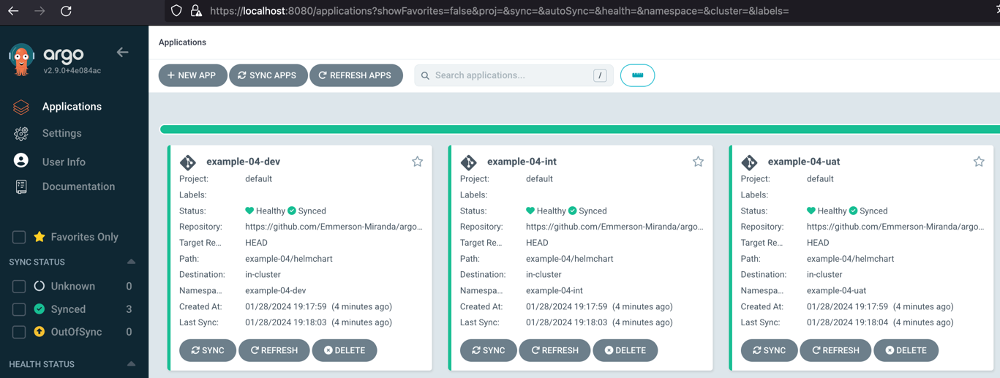

# Introduction
Deploy in multiple environments. Uses *ApplicationSet*, static *list generator*, basic *Helm charts* with *values* and *with syncPolicy*. Uses Helm Chart source code from *git*.

More info at: 
- https://argo-cd.readthedocs.io/en/stable/user-guide/application-set/
- https://argo-cd.readthedocs.io/en/stable/user-guide/helm/
- https://argocd-applicationset.readthedocs.io/en/stable/Generators/
- https://argo-cd.readthedocs.io/en/stable/user-guide/sync-options/
- https://github.com/argoproj/argocd-example-apps/tree/master/helm-guestbook
- https://amralaayassen.medium.com/how-to-create-argocd-applications-automatically-using-applicationset-automation-of-the-gitops-59455eaf4f72


Installation instructions

Creating

```
kubectl apply -n argocd -f https://raw.githubusercontent.com/Emmerson-Miranda/argocd/main/example-04/example-04.appset.yaml
```


Deleting

```
kubectl delete -n argocd -f https://raw.githubusercontent.com/Emmerson-Miranda/argocd/main/example-04/example-04.appset.yaml
```