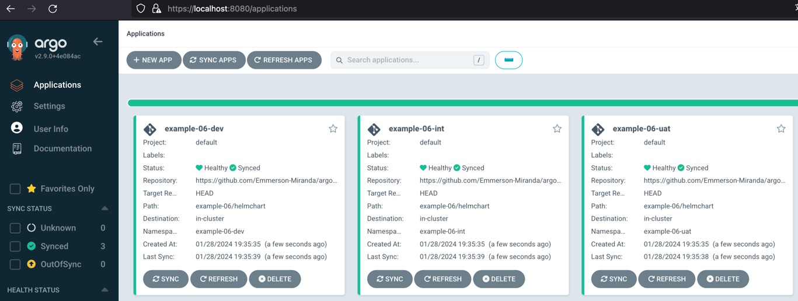

# Introduction
Deploy in multiple environments. Uses *ApplicationSet*, dynamic *git generator*, basic *Helm charts* with *values* and *with syncPolicy*. Uses Helm Chart source code from *git*. Overrides parameters per environment.

The environment generation is dynamic and comes from a git repo, for simplicity I used the same git repo but a different folder.

More info at: 
- https://argo-cd.readthedocs.io/en/stable/user-guide/best_practices/
- https://argo-cd.readthedocs.io/en/stable/user-guide/application-set/
- https://argo-cd.readthedocs.io/en/stable/user-guide/helm/
- https://argocd-applicationset.readthedocs.io/en/stable/Generators/
- https://argo-cd.readthedocs.io/en/stable/user-guide/sync-options/
- https://github.com/argoproj/applicationset/tree/master/examples/git-generator-files-discovery


## Installation instructions

Creating

```bash
kubectl apply -n argocd -f https://raw.githubusercontent.com/Emmerson-Miranda/argocd/main/example-06/example-06.appset.yaml
```


Deleting

```bash
kubectl delete -n argocd -f https://raw.githubusercontent.com/Emmerson-Miranda/argocd/main/example-06/example-06.appset.yaml
```