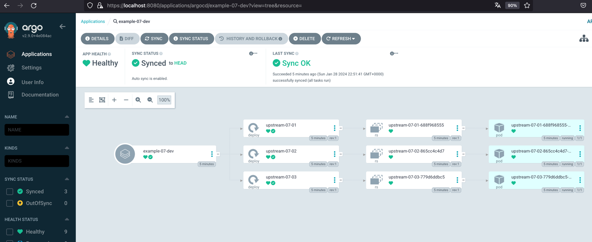
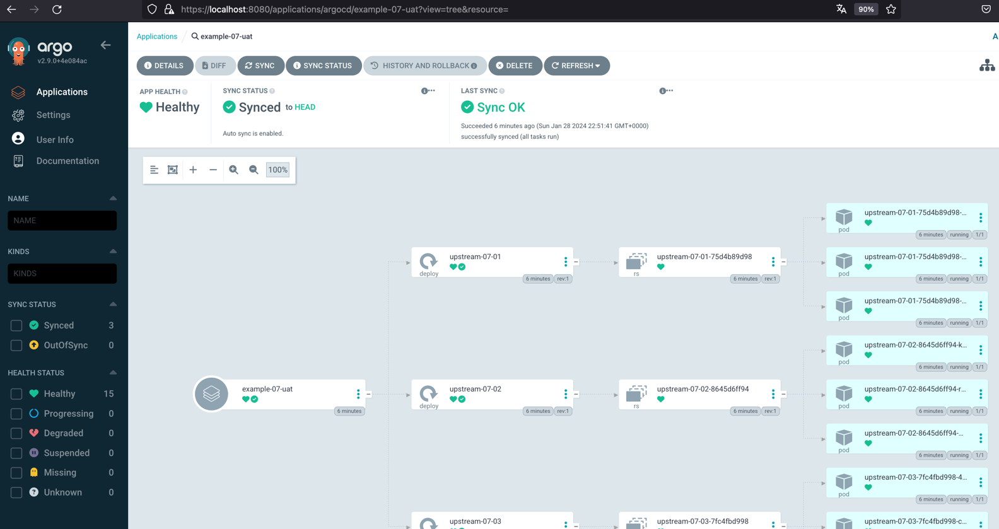

# Introduction
Deploy in multiple environments. Uses *ApplicationSet*, dynamic *git generator*, basic *Helm charts* with *file values* and *with syncPolicy*. Uses Helm Chart source code from *git*. Inject values into chart from a Git repo. 

The environment generation is dynamic and comes from a git repo.

## Installation instructions

Creating

```bash
kubectl apply -n argocd -f https://raw.githubusercontent.com/Emmerson-Miranda/argocd/main/example-07/example-07.appset.yaml
```

As per config in a separate git repo there is only one replica for DEV.



As per config in a separate git repo there are three replicas for UAT.


Deleting

```bash
kubectl delete -n argocd -f https://raw.githubusercontent.com/Emmerson-Miranda/argocd/main/example-07/example-07.appset.yaml
```