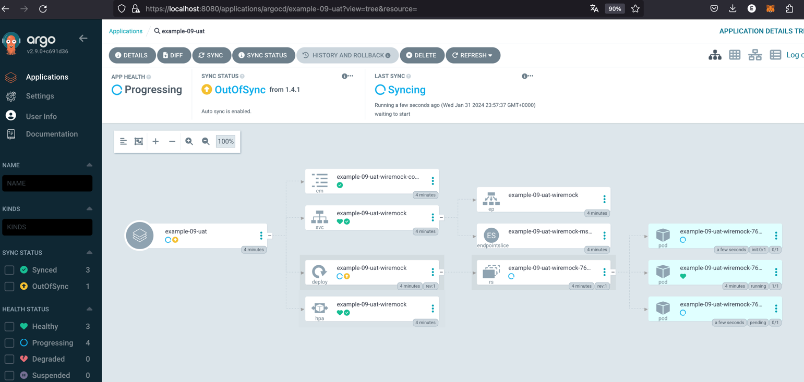

# Introduction
Deploy in multiple environments. Uses *ApplicationSet*, dynamic *git generator*, use external *Helm chart*(wiremock) with *file values* and *with syncPolicy*. Inject values into chart from a Git repo.


## Installation instructions

Creating

```bash
kubectl apply -n argocd -f https://raw.githubusercontent.com/Emmerson-Miranda/argocd/main/example-09/example-09.appset.yaml
```

As per config in a separate git repo there are three replicas for UAT.


Deleting

```bash
kubectl delete -n argocd -f https://raw.githubusercontent.com/Emmerson-Miranda/argocd/main/example-09/example-09.appset.yaml
```