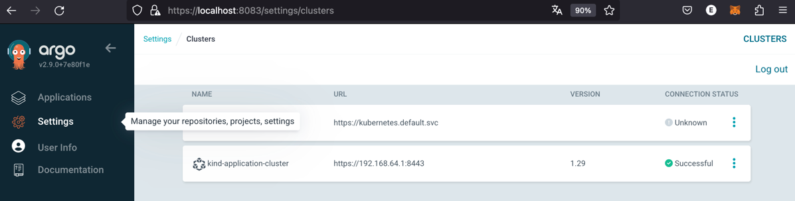
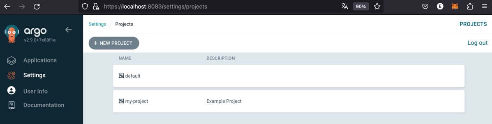
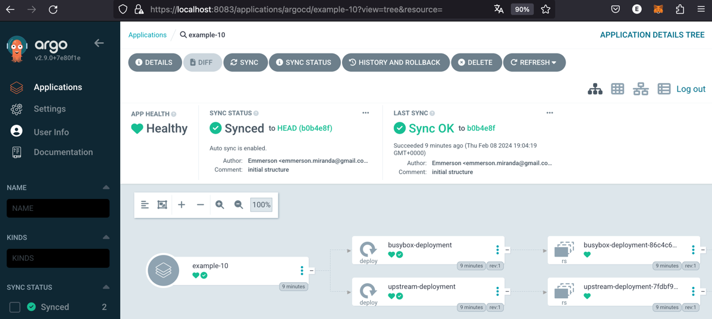

# Introduction
Simple PoC to deploy argoCD application in a remote cluster.

- Create two kubernetes cluster using KinD (argocd-cluster and application-cluster)

```
kubectl config get-contexts
CURRENT   NAME                       CLUSTER                    AUTHINFO                   NAMESPACE
          kind-application-cluster   kind-application-cluster   kind-application-cluster   
*         kind-argocd-cluster        kind-argocd-cluster        kind-argocd-cluster   
```

- Deploy ArgoCD in argocd-cluster

```
kubectl get po -n argocd -o wide
NAME                                                READY   STATUS    RESTARTS   AGE   IP           NODE                    NOMINATED NODE   READINESS GATES
argocd-application-controller-0                     1/1     Running   0          19m   10.244.1.8   argocd-cluster-worker   <none>           <none>
argocd-applicationset-controller-56c959df55-jr4bk   1/1     Running   0          19m   10.244.1.2   argocd-cluster-worker   <none>           <none>
argocd-dex-server-5f77c4fbc9-sldhm                  1/1     Running   0          19m   10.244.1.5   argocd-cluster-worker   <none>           <none>
argocd-notifications-controller-5f94cb7845-7w2m9    1/1     Running   0          19m   10.244.1.3   argocd-cluster-worker   <none>           <none>
argocd-redis-76748db5f4-4gp4l                       1/1     Running   0          19m   10.244.1.4   argocd-cluster-worker   <none>           <none>
argocd-repo-server-f7646b949-pgpcq                  1/1     Running   0          19m   10.244.1.7   argocd-cluster-worker   <none>           <none>
argocd-server-79bbfb8ffc-r5kxf                      1/1     Running   0          19m   10.244.1.6   argocd-cluster-worker   <none>           <none>
```

- Register a kubernetes cluster in ArgoCD using argocd CLI


- Register declaratively a new project in Argo called "my-project"


- The application example-10 in deployed in application-cluster.


```
kubectl get po -n example-10 -o wide
NAME                                  READY   STATUS    RESTARTS   AGE     IP           NODE                         NOMINATED NODE   READINESS GATES
busybox-deployment-86c4c67f86-czjz2   1/1     Running   0          3m38s   10.244.1.3   application-cluster-worker   <none>           <none>
upstream-deployment-7fdbf9974-w7sgn   1/1     Running   0          3m38s   10.244.1.2   application-cluster-worker   <none>           <none>
```

## Installation instructions

Install ArgoCD CLI, see [Instructions here](../README.md)

```bash
./clusters-start.sh
```


## Deleting everything

```bash
./clusters-delete.sh
```