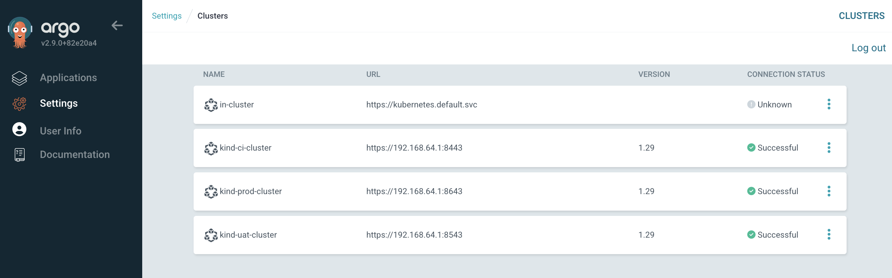

# Introduction
This example will deploy applications (nginx-ingress, prometheus and wiremock) in multiple clusters (ci, uat and prod) depending wether deploy configuration is enabled or not.

Create Four clusters using KinD
- Tooling - Contains ArgoCD 
- ci   - Target cluster to deploy applications
- uat  - Target cluster to deploy applications
- prod - Target cluster to deploy applications

This example uses goTemplates with "matrix generator" to combine "cluster generator" excluding ArgoCD "in-cluster" using a selector and "git generator" which contains the list of applications to be deployed organized by folders.

## Installation
To install or destroy this example you can use bellow scripts.
````
example-11
├── clusters-create.sh  <-- create all clusters, deploy argo and applications
├── clusters-destroy.sh <-- destroy all clusters
````


## Git generator configuration
The applicationSet **[example-11.matrixgenerator.yaml](./example-11.matrixgenerator.yaml)** reads reads and generate as many application are defined in the config folder.
```yaml
- path: "example-11/config/**/config.yaml"
```

The configuration for git generator is organized as follows:
```
example-11
├── config
│   ├── kind-ci-cluster-values.yaml
│   ├── kind-prod-cluster-values.yaml
│   ├── kind-uat-cluster-values.yaml
│   ├── nginx-ingress
│   │   ├── config.yaml   <-- ArgoCD application definition values
│   │   └── values.yaml   <-- helm values yaml for nginx-ingress
│   ├── prometheus
│   │   ├── config.yaml   <-- ArgoCD application definition values (deploy: "false")
│   │   └── values.yaml   <-- helm values yaml for prometheus
│   └── wiremock
│       ├── config.yaml   <-- ArgoCD application definition values
│       └── values.yaml   <-- helm values yaml for wiremock
```

## Clusters created with KinD
All servers created by kind are using an internal IP address that may be updated to match your network.
The IP was obtained using `ifconfig | grep "192.168"`
```yaml
apiServerAddress: "192.168.64.1"
```
Folder structure
````
example-11
├─
├── kind
│   ├── 10-tooling-cluster.yaml
│   ├── 20-ci-cluster.yaml
│   ├── 30-uat-cluster.yaml
│   └── 40-prod-cluster.yaml
````
After installation all clusters are registred automatically.

```
$ kubectl config get-contexts
CURRENT   NAME                   CLUSTER                AUTHINFO               NAMESPACE
          kind-ci-cluster        kind-ci-cluster        kind-ci-cluster        
          kind-prod-cluster      kind-prod-cluster      kind-prod-cluster      
*         kind-tooling-cluster   kind-tooling-cluster   kind-tooling-cluster   
          kind-uat-cluster       kind-uat-cluster       kind-uat-cluster       
```

When a cluster is registred in ArgoCD some labels and annotations are added (see **[example-11.cluster.template.yaml](./example-11.cluster.template.yaml)**).


## Applications deployed
All applications are deployed as per configuration except "prometheus" because the "deploy" property is false.
```yaml
selector:
    matchExpressions:
    - {key: deploy, operator: In, values: ["true"]}
```

The deployment configuration also exclude clusters based on cluster labels.
```yaml
selector:
matchExpressions:
- {key: type, operator: In, values: ["applications"]}
```

Finally we have all applications deployed


In this example the applicationset inject two files as helm values, ArgoCD mix-in both, values in the second file override the values in the first file.

```yaml
- helm:
    valueFiles:
    - $values/{{index .path.segments 0}}/{{index .path.segments 1}}/{{.name}}-values.yaml 
    - $values/{{.path.path}}/values.yaml # same folder as config.yaml loaded
```


