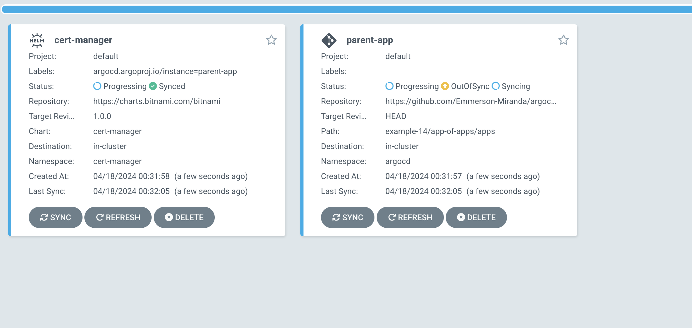
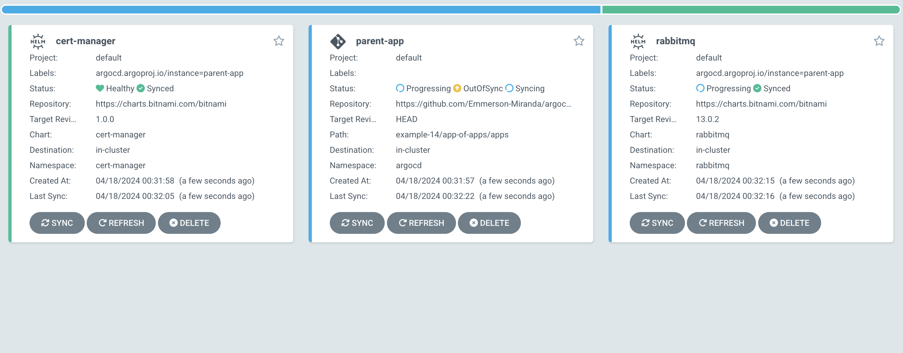

# Introduction
App of apps with sync waves.
-children-created.png)

Install 3 applications in the following order:
1. cert-manager chart from bitnami repo
   
2. rabbitmq chart from bitnami repo
   
3. custom helmchart inside this repo
   -children-created.png)


## etc/hosts

```bash
192.168.64.1    argocd.owl.com
```

## Cluster creation and destroy

Creation
```bash
./clusters-create.sh
```

Destroy
```bash
./clusters-destroy.sh
```

## ArgoCD UI
"admin" password admin-password-argocd.txt file, created during cluster creation..

```bash
open -a firefox -g https://argocd.owl.com
```

## Other references

Another example [here](https://github.com/jannfis/app-of-apps)
