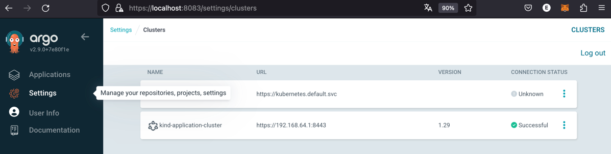
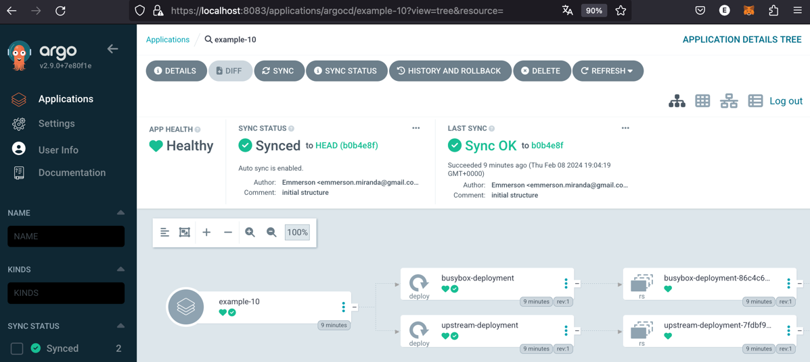
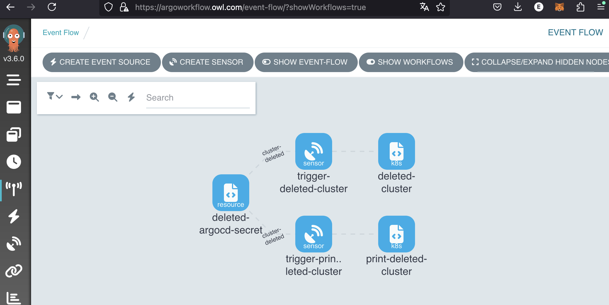
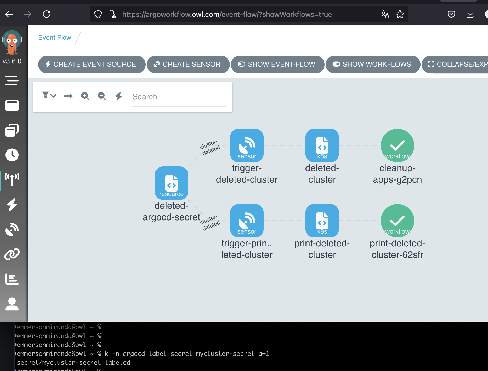
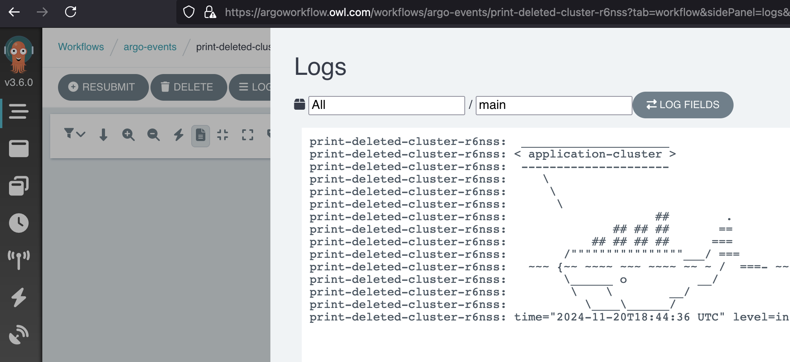
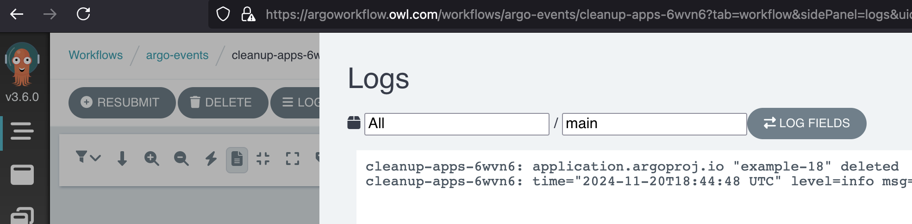

# Introduction
Based on example [01](./example-01/readme.md) deploy simple applications from a directory. 
- This example create two K8S clusters with *KinD*.
- Install:
  - ArgoCD
  - Argo Events
  - Argo Workflow
- Register *a remote cluster* declaratively* in ArgoCD. 
- Deploy applications into a *remote cluster* with ArgoCD. 

ArgoCD cluster registration is just a secret, when a cluster is removed from ArgoCD, all applications remain orphans waiting until the cluster is restored. 

This PoC also configure *Argo Events* to listen kubernetes events when the secret is modified or deleted, then it trigger an Argo Worflow to delete the orphan argocd-applications.
- One event source listening changes in kubernetes
- Two worflows
  - Print the cluster that trigger the action
  - Clean up ArgoCD applications


## Installation 

To create clusters:

```bash
./clusters-create.sh
```

After installation finish, open on your browser below links:
* https://argocd.owl.com/
* https://argoworkflow.owl.com/


To delete clusters:

```bash
./clusters-destroy.sh
```

Install ArgoCD CLI, see [Instructions here](../README.md)

## How to trigger deletion wokflow

There are three ways to trigger the workflow:
1) Deleting the secret from command line

```bash
kubectl -n argocd delete secret kind-application-cluster-secret 
```

2) Deleting the cluster using ArgoCD UI (Settings -> Clusters -> three dots -> Delete)
   Internally ArgoCD don't delete the secret, instead remove the argo annotation.

3) modifying the secret from command line
```bash
kubectl -n argocd label secret kind-application-cluster-secret a=1
```


## Screenshots

**ArgoCD - clusters**


**ArgoCD - application**


**Argo Workflow - before trigger deletion**


**Argo Workflow - After trigger deletion**


**Argo Workflow - logs**



