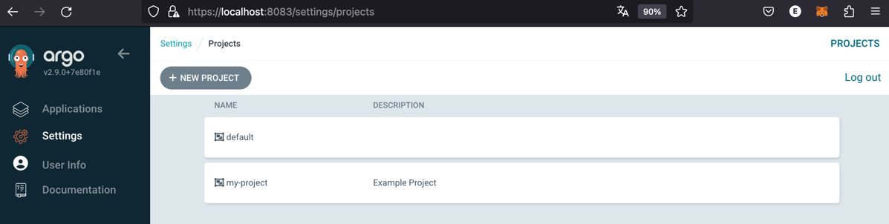

# Introduction
Based on example [01](./example-01/readme.md) . Deploy into a *remote cluster*. Register *cluster* and creates a *new project declaratively*. This example create two K8S clusters with *KinD*.

This example deploy Argo Events and Argo Workflow.

- Create two kubernetes cluster using KinD (argocd-cluster and application-cluster)

```
kubectl config get-contexts
CURRENT   NAME                       CLUSTER                    AUTHINFO                   NAMESPACE
          kind-application-cluster   kind-application-cluster   kind-application-cluster   
*         kind-argocd-cluster        kind-argocd-cluster        kind-argocd-cluster   
```

- Register a kubernetes cluster in ArgoCD using argocd CLI


- Register declaratively a new project in Argo called "my-project"


- The application example-18 in deployed in application-cluster.f


```
kubectl get po -n example-18 -o wide
NAME                                  READY   STATUS    RESTARTS   AGE     IP           NODE                         NOMINATED NODE   READINESS GATES
busybox-deployment-86c4c67f86-czjz2   1/1     Running   0          3m38s   10.244.1.3   application-cluster-worker   <none>           <none>
upstream-deployment-7fdbf9974-w7sgn   1/1     Running   0          3m38s   10.244.1.2   application-cluster-worker   <none>           <none>
```

## Installation instructions

Install ArgoCD CLI, see [Instructions here](../README.md)

Script will use 30080 and 30443 ports on your localhost.

```bash
./clusters-create.sh
```


## Deleting everything

```bash
./clusters-destroy.sh
```
